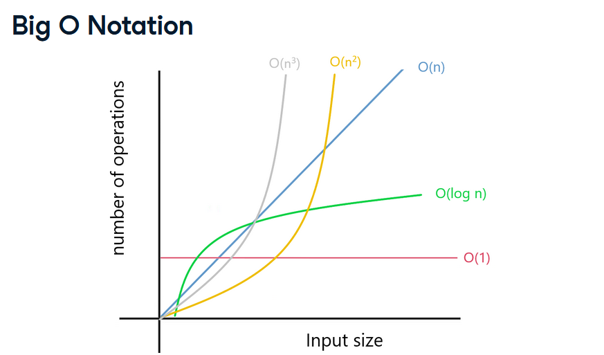
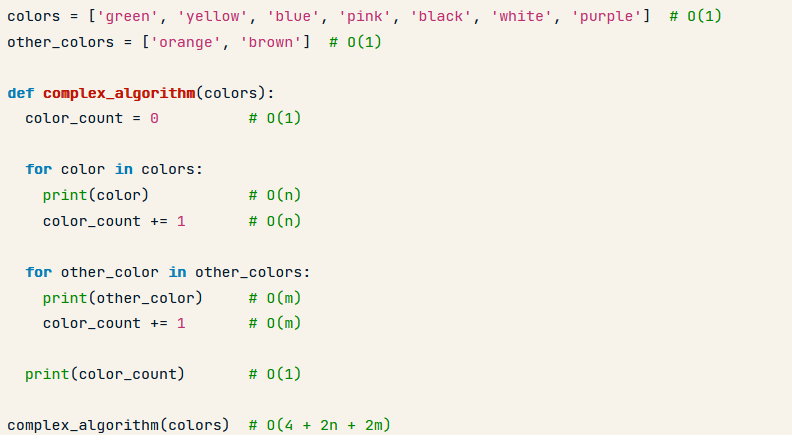

## Understanding Big O Notation

## Big O Notation
- Measures the worst-case complexity of an algorithm
    - Time Complexity: time taken top run completely
    - Space Complexity: extra memory space
- Doesn't use seconds/bytes
    - Different results depending on the hardware
- Mathematical Expressions: O(1), O(n), O(n^2), O(n^3)

Expressions Plotted


- O(1) - num of operation remains constant even if input size change | constant
```python
colors = ['green', 'yellow', 'blue', 'pink']

def constant(colors):
    print(colors[2]) # O(1)

constant(colors)
```

- O(n) - num of operation increases proportionally with increased input
```python
colors = ['green', 'yellow', 'blue', 'pink']

def linear(colors):
    for color in colors: #O(n)
        print(color)

linear(colors)
```
- O(n^2)  - quadratic time
```python
colors = ['green', 'yellow', 'blue']

def quadratic(colors):
    for first in colors: #O(n)
        for second in colors: #O(n)
            print(first, second)

quadratic(colors)
```

- O(n^3)  - cubic time
```python
colors = ['green', 'yellow', 'blue']

def cubic(colors):
    for color1 in colors: #O(n)
        for color2 in colors: #O(n)
            for color3 in colors: #O(n)
                print(color1, color2, color3)

cubic(colors)
```

## Computing Big O Notation


## Simplify Big O Notation
1. Remove constants
    - O(4 + 2n + 2m) -> O(n + m)
2. Different variables for different inputs
    -O(n + m)
3. Remove smaller terms | Keep the term that increases faster
    - O(n + n^2) -> O(n^2)


