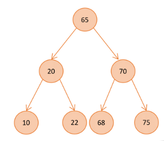
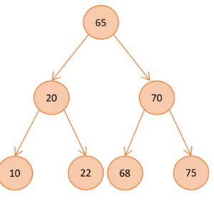
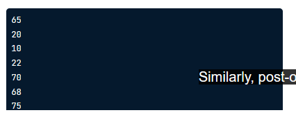
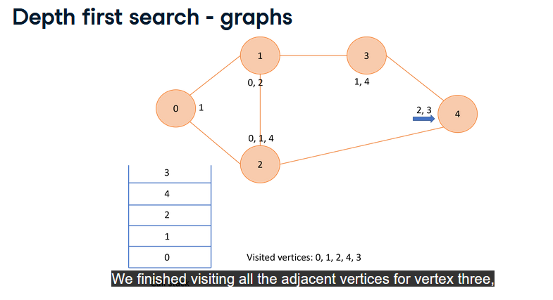
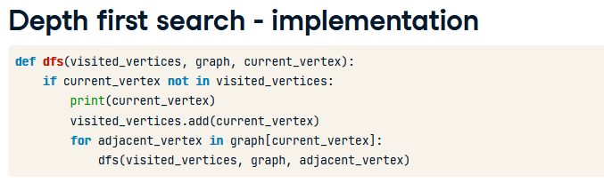

# Depth First Search

## Tree/graph traversal
- process of visiting all nodes
- DFS
- Breadth first Search

## DFS - binary trees
- In order traversal
    - order: root => left -> current -> right
    - output in ascending order
    
    - Output:
    -
```python
def in_order(self, current_node):
    if current_node:
        self.in_order(current_node.left_child)
        print(current_node.data)
        self.in_order(current_node.right_child)

my_tree.in_order(my_tree.root)
```
- Pre-order traversal
    - Order: current -> left -> right
    - 
    - Output
    - 

```python
def pre_order(self, current_node)
    if current_node:
        print(current_node.data)
        self.pre_order(current_node.left_child)
        self.pre_order(current_node.right_child)
```
- Post-order
    -Order: Left -> Right -> Current 

## When to use
- In-order: obtain node values in ascending order
- Pre-order: create copies of a tree and get prefix expressions
- Post-order: get postfix expressions

## Depth first search - graphs
- graph can have cycles
    - keep track of visited vertices

Steps
1. Start at any vertex
2. Tracks current vertex to visited vertices list
3. For each current node's adjacent vertex
    - if it has been visited -> ignore
    - havent -> recursively perform dfs


- Implementation

- Complexity: O(V + E)
    - V -> no. of vertices
    - E -> no. of edges
